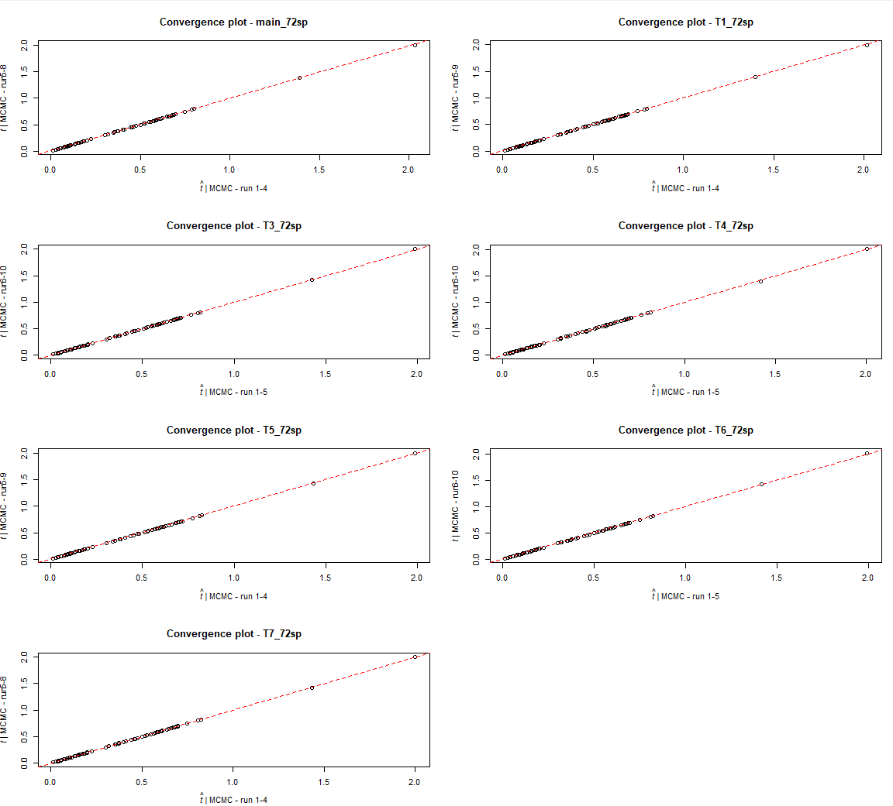

# 1. Running MCMCtree
Now that we have computed the Hessian and the branch lengths in the previous step,
we can run `MCMCtree` using the approximate likelihood for Bayesian divergence times
estimation ([dos Reis and Yang, 2011](https://academic.oup.com/mbe/article/28/7/2161/1051613)). 
Nevertheless, before sampling from the posterior distribution, we are going to first run an analysis without 
data, that is, we are going to collect samples from the prior distribution. 

If we see this using the Bayes' theorem, when we are not including the data during Bayesian inference 
we are basically sampling from the prior:   
  >$f(\mathrm{\mathbf{t}},\mathbf{r},\mathbf{\theta}|D)\propto f(\mathbf{\theta})f(\mathrm{\mathbf{t}})f(\mathrm{\mathbf{r}}|\mathbf{t,\mathbf{\theta}})\times f(D|\mathrm{\mathbf{t}},\mathbf{r},\mathbf{\theta})\propto f(\mathbf{\theta})f(\mathrm{\mathbf{t}})f(\mathrm{\mathbf{r}}|\mathbf{t,\mathbf{\theta}})$   
  >$posterior\propto prior\times likelihood$   
  >$posterior\propto prior\times1$   
  >$posterior\propto prior$   
	  
Therefore, we want to check that the priors on times and rates that we set in `MCMCtree`, i.e., the "user-specified" prior,
are really the ones that the dating software is using, i.e., the "effective prior". That could also help us identify
which prior calibrations are in conflict with other nearby calibrations, which might need to be tweaked so the 
effective prior is close to the user-specified prior.   

In addition, once we get the mean estimates for the node ages when sampling both from the prior (no molecular data used) 
and the posterior (using molecular data), we can plot them one on top of another to assess possible 
conflict, i.e., the posterior distribution falling outside the range delimited by the prior distribution.
If this were the case, this would mean that molecular data and the clock model used are suggesting, 
when sampling from the posterior during the MCMC, that the node age is either younger or older than what was 
supposed when setting the calibration densities. This would just be an example of the difficulties involved 
when deciding the maximum and minimum bounds when constructing fossil calibrations for the nodes in the 
phylogeny.   
	  
Once we are sure that there are no conflicts, we can then evaluate the Bayesian inference of 
posterior times for the 72-taxon mammal phylogeny.

Below, you will find the links to the files that contain the results obtained when running
`MCMCtree` for all the tree hypotheses. In this GitHub repository, you will be able to find the
scripts and the plots generated with the data, but the data are too big to be stored here.
Therefore, please download the files using the links that we provide below if you want to reproduce our 
results when running the scripts provided here.

## Prior 
We provide the results obtained when using `MCMCtree` while sampling from the prior and using the
main tree hypothesis (T2) [here](https://www.dropbox.com/s/bum031cge8qp8sb/SeqBayesS1_MCMCtree_mainT2_prior.zip?dl=0).

We ran five independent MCMC with the aim to increase ESS and improve MCMC convergence. When 
running `MCMCtree`, we used a dummy alignment because, when sampling from the prior,
the molecular data are not used.
This can help to reduce the amount of disk space used as there is no need to have the
alignment file (large size) when sampling from the prior.
The important options that need to be used in the control file are the following:   
   
   * `usedata = 0`: this sets `MCMCtree` sampling from the prior.   
   * `clock = 1`: no molecular data are used, therefore there is no need to tell `MCMCtree`
     to use a complex clock model.   
   * `model = 0`: the same as mentioned above applies to the nucleotide substitution model.   
	
An example of the control file we used is shown below. Only the name passed to the `treefile` option 
needs to be changed according to each tree hypothesis:   

```
          seed = -1
       seqfile = dummy_aln.aln
      treefile = 72sp_atlantogenata_tarver2016_MCMCtree_calib.tree
      mcmcfile = mcmc.txt
       outfile = out.txt

         ndata = 1
       seqtype = 0    * 0: nucleotides; 1:codons; 2:AAs
       usedata = 0    * 0: no data (prior); 1:exact likelihood;
                      * 2:approximate likelihood; 3:out.BV (in.BV)
         clock = 1    * 1: global clock; 2: independent rates; 3: correlated rates

         model = 0    * 0:JC69, 1:K80, 2:F81, 3:F84, 4:HKY85
         alpha = 0.5  * alpha for gamma rates at sites
         ncatG = 5    * No. categories in discrete gamma

     cleandata = 0    * remove sites with ambiguity data (1:yes, 0:no)?

       BDparas = 1 1 0.1    * birth, death, sampling

   rgene_gamma = 2 40   * gammaDir prior for rate for genes
  sigma2_gamma = 1 10    *s gammaDir prior for sigma^2     (for clock=2 or 3)

         print = 1   * 0: no mcmc sample; 1: everything except branch rates 2: everything
        burnin = 10000
      sampfreq = 1000 
       nsample = 20000
```

When the 5 independent MCMC runs finished, we summarised the inferred trees for each independent
chain using the script `Combine_MCMC.sh`. This script generates the `mcmc_files` directory and the 
`mcmc_tracer.txt` file, which concatenates the results sampled in each of the five chains. Then,
we set `print = -1` in the control file to run `MCMCtree` with the `mcmc_tracer.txt` so we
can obtain the tree file with branch lengths when using all the samples collected (`FigTree.tre`). 

If you have downloaded the zip file provided above with the `MCMCtree` output files, you will find these 
files inside `00_MCMCtree_prior`.

## Posterior
Inferring posterior divergence times for the 72-taxon mammal phylogeny was done under the 
7 tree hypotheses described in the previous steps and under the best-fitting relaxed-clock model:
the autocorrelated-rates model (we use `GBM` in the directories saved in this GitHub repository to identify
analyses under this clock).

At the same time, in order to increase ESS and ensure MCMC convergence, we ran several independent
chains with `MCMCtree`. As mentioned above, we had to repeat the analyses under the main tree
hypothesis (T2) so the alignment did not contain 11 genes that were also present in the data set
that is to be used in the second step of the sequential Bayesian dating analysis.
This does not affect the analyses with the other 6 tree hypotheses. You can download
the results obtained with `MCMCtree` when using the alignment **without** these 11 genes for the 
main tree hypothesis
[here](https://www.dropbox.com/s/kh73rbu9cnxts3r/SeqBayesS1_MCMCtree_mainT2_posterior.zip?dl=0), 
the results obtained with `MCMCtree` when using the alignment **with** these 11 genes for the main 
tree hypothesis
[here](https://www.dropbox.com/s/qxsgfe0gbwxro9p/SeqBayesS1_MCMCtree_mainT2_posterior_old.zip?dl=0),
and the results obtained with `MCMCtree` when using the alignment **with** these 11 genes for the rest 
of the alternative 6 hypotheses 
[here](https://www.dropbox.com/s/09u8l81dgw166do/SeqBayesS1_MCMCtree_6treehyp_MCMCtree.zip?dl=0).
When you unzip the corresponding files, you will find the following directories, which should 
be saved either under the `00_main_tree_T2` directory or the `01_alternative_tree_hypotheses` 
directory to reproduce the results with the R scripts provided (paths already set according 
to this file architecture). They should be saved as it follows:   

   * `00_main_tree_T2/01_MCMCtree_posterior/02_atlantogenata_tarver2016/mcmc_files`:
   here, you will find the results obtained with `MCMCtree` when using the main tree 
   hypothesis (T2) and the alignment **without** the 11 genes also found in data set 2.
   The `mcmc_tracer.txt` file contains the samples collected during all the chains ran in `MCMCtree`
   that had successfully converged (8). The phylogeny in the `FigTree.tre` file has
   been generated with this file.   
   * `00_main_tree_T2/01_MCMCtree_posterior_old/mcmc_files_filt`:
   here, you will find the results obtained with `MCMCtree` when using the main tree 
   hypothesis (T2) and the alignment **with** the 11 genes also found in data set 2.
   The `mcmc_tracer.txt` file contains the samples collected during all the chains ran in `MCMCtree`
   that had successfully converged (7). The phylogeny in the `FigTree.tre` file has
   been generated with this file.
   * `01_alternative_tree_hypotheses/00_MCMCtree_analyses/01_alternative_tree_hypotheses/00_MCMCtree/mcmc_files`:
   here, you will find the results obtained with `MCMCtree` when using the
   other 6 alternative tree hypotheses. Note that, in this directory, each `mcmc_tracer.txt`
   file contains the samples collected during the 10 MCMCs and the corresponding `FigTree.tre`
   files were generated with this information for each tree hypothesis, unless some of these chains 
   have not converged (e.g., chain 2 in T1, chain 10 in T5, and chains 1 and 4 in T7; see R script 
   [`Calculate_ESS.R`](01_ESS_and_chain_convergence/Calculate_ESS.R) for more information).   

In addition, we repeated the analyses in `MCMCtree` with the updated 
geochronology (i.e., updated set of prior calibrations as of September 2021) which you can download from 
[here](https://www.dropbox.com/s/53mdfyc47hukkrh/SeqBayesS1_MCMCtree_mainT2_posterior_newchrono.zip?dl=0).
Once you unzip this file, you should save the unzipped directory inside `00_main_tree_T2`. You will then be 
able to see the summarised results for all the chains that converged here:   

   * `00_main_tree_T2/02_MCMCtree_posterior_newchrono/mcmc_files`: 
   here, you will find the results obtained with `MCMCtree` when using the main tree 
   hypothesis (T2) calibrated with the updated set of priors as of September 2021 and the alignment
   **without** the 11 genes also found in data set 2. The `mcmc_tracer.txt` file contains the samples 
   collected during the chains rain in `MCMCtree` that had successfully converged (3; see R script 
   [`Calculate_ESS.R`](01_ESS_and_chain_convergence/Calculate_ESS.R) for more information). The phylogeny 
   in the `FigTree.tre` file has been generated with this file.   


# 2. Checks

## 2.1. Visual checks - `MCMCtreeR`
First, we ran a modified version of the `MCMCtreeR::mcmc.tree.plot` function of the `MCMCtreeR` R package ([Puttick 2019](https://academic.oup.com/bioinformatics/article/35/24/5321/5530964?login=true),
see [the corresponding GitHub repository](https://github.com/PuttickMacroevolution/MCMCtreeR)), which we 
have added in the `Functions_plots_MCMCtreeR.R` (see [here](00_MCMCtree_analyses/00_main_tree_T2/visual_checks_MCMCtreeR/Functions_plots_MCMCtreeR.R),
although the same file can be found 
[here](00_MCMCtree_analyses/01_alternative_tree_hypotheses/visual_checks_MCMCtreeR/Functions_plots_MCMCtreeR.R)).
Thanks to the plots output by this modified function, we can visually explore if there were any chains that might
have had convergence problems.
You can find the results in the following directories:   

   * [Main tree - T2](00_MCMCtree_analyses/00_main_tree_T2/visual_checks_MCMCtreeR): As mentioned above, we have the results for the analyses using the alignment
   with and without the 11 genes that are also found in the second data set. In the `plots` directory,
   you can find the graphics plotted with the R scripts within the directory provided in the link
   above. The R scripts have all the details needed to understand the different steps carried out,
   so you may want to check them if you want more details about how these plots were generated.
   In addition, [this directory](00_MCMCtree_analyses/00_main_tree_T2/plot_oldtimesVSnewtimes) contains the plots generated
   with the results obtained with both data sets to evaluate the (almost null) impact that removing these 11
   genes from the data set had on the posterior divergence times: the estimates were almost
   identical. You may want to read the details in the R script provided in this
   directory for further details. You also have a plot with the mean ages for the filtered chains for both analyses
   [here](00_MCMCtree_analyses/00_main_tree_T2/plots/02_NEW-mean_filtered_postVSmean_filtered_oldpost).
   * [Alternative tree hypotheses](00_MCMCtree_analyses/01_alternative_tree_hypotheses/visual_checks_MCMCtreeR): In this directory, you will see one script for each tree
   hypothesis, which were used to generate the plots you fill find the link provided above.

Even though you can find the plots for all the hypotheses in the directories mentioned above,
[here](../../figs/FigS5.pdf) (Figure S5) you can see the plot for the main tree hypothesis (T2) before and after keeping the chains 
that did not show any visual problems.

>>**_Caption for the figure provided in the link above:_**   
>>*The posterior distributions for the mean*
>>*divergence times estimated in runs 1 to 16 are shown for the corresponding nodes in (a), while*
>>*(b) does not include the results for chains 1, 2, 5, 6, 10, 12, 14, 15 as they seem to have have*
>>*had convergence issues if compared to the mean time estimates obtained with the other chains*
>>*Abbreviations: Qua. = Quaternary.*

Apart from these analyses, we also visually evaluated the chains ran with
the alignment without the 11 genes that can be found in the second data set and with the updated prior calibrations 
according to the geochronology established as of September 2021. In the `plots` directory,
you can find the graphics plotted with the R script 
[`01_Check_MCMCs_MCMCtreeR_newpost_newgeochron.R`](00_MCMCtree_analyses/00_main_tree_T2/visual_checks_MCMCtreeR/01_Check_MCMCs_MCMCtreeR_newpost_newgeochron.R`)
As in the other R scripts used before, this one has all the details needed to understand the different steps carried out,
so you may want to check them if you want more details about how these plots were generated.
In addition, [this directory](00_MCMCtree_analyses/00_main_tree_T2/plot_newchrVSoldchr) contains the comparison 
plots generated for each calibrated node with the results obtained with this data set (updated geochronology) against 
those that were obtained with the prior calibrations used before September 2021. These plots show how changing 
the prior calibrations based on the updated geochronology has no effect on the posterior time estimates as the 
posterior time estimates are almost identical. You may want to read the details in the R script provided in this directory,
[`02_Plot_oldgeochVSnewgeoch.R`](00_MCMCtree_analyses/00_main_tree_T2/plot_newchrVSoldchr/02_Plot_oldgeochVSnewgeoch.R),
for further details.   

>> **NOTE**: Note that the next check to evaluate chain convergence (check conflict in quantiles) detected some 
>> issues in some chains (e.g., chain 2 in T1, chain 10 in T5, chains 1 and 4 in T7, and chain 2 in the main tree
>> hypothesis T2 when using the updated prior calibrations) which visually did not seem to have any problem.
>> You will read more about this in the next section!

## 2.2. Calculate ESS and evaluate chain convergence
To ensure MCMC convergence and increase effective sample size (ESS), we ran several MCMCs
of sufficient length. We used the [`coda::effectiveSize`](http://oro.open.ac.uk/22547/) and [`Tracer`](https://pubmed.ncbi.nlm.nih.gov/29718447/)
to make sure the ESS was larger than 200 for all estimated parameters. We also used the R
function [`rstan::monitor`](https://mc-stan.org/users/citations/)
to calculate the ESS for bulk and tail quantiles and the potential scale reduction factor on
rank normalised split chains (Rhat). Values over 100 for the former are considered good, while Rhat
values need to be either smaller than or equal to 1.05 to show chain convergence.  

In the [`01_ESS_and_chain_convergence`](01_ESS_and_chain_convergence)
directory, you will find the [`Calculate_ESS.R`](01_ESS_and_chain_convergence/Calculate_ESS.R)
R script, which was used to generate the convergence plots for each tree hypothesis as well as to
calculate the ESS for each `MCMCtree` analysis that was 
run under each tree hypothesis.

If you download the zip file provided above with the results obtained when running `MCMCtree`,
you will be able to run this script and reproduce the plots and the output data provided in this
directory. 

A summary of these checks for the analyses ran for each tree hypothesis can be found in the table
below. A summary of the measures of effective sample size (ESS) for each tree hypothesis (T1-T7) 
can be found in the table below . The ESS for bulk and tail quantiles together with the Rhat were
measured for each parameter with the R package `rstan::monitor`. In addition, the ESS calculated
with the `coda::effectiveSampleSize` has been included for comparison.

>>**Table S7**. Measures of effective sample size (ESS).   

|                          | MAIN (UPD)| MAIN (OLD) |T1         | T3       | T4         | T5         | T6        | T7         |   
|--------------------------|-----------|------------|-----------|----------|------------|------------|-----------|------------|
| tail-ESS times (median)  | 232       | 929        | 2074      | 1839     | 2007       | 1118       | 2721      | 1362       |
| tail-ESS times (min)     | 61        | 216        | 507       | 503      | 451        | 361        | 442       | 196        |
| tail-ESS times (max)     | 3884      | 11669      | 22442     | 28525    | 27303      | 15411      | 29174     | 21129      |
| bulk-ESS times (median)  | 180       | 374        | 1062      | 949      | 968        | 709        | 1295      | 751        |
| bulk-ESS times (min)     | 22        | 56         | 142       | 98       | 177        | 125        | 193       | 103        |
| bulk-ESS times (max)     | 2888      | 8358       | 16211     | 18054    | 19469      | 11241      | 19324     | 14015      |
| Rhat (min)               | 0.9999884 | 1.000024   | 0.9999901 | 0.999998 | 0.9999954  | 0.9999916  | 0.9999919 | 1.000035   |
| coda-ESS times  (median) | 426       | 1255       | 2495      | 2141     | 2301       | 1765       | 2634      | 2147       |
| coda-ESS times  (min)    | 62        | 179        | 285       | 353      | 373        | 330        | 355       | 266        |
| coda-ESS times  (max)    | 5722      | 9868       | 31305     | 34459    | 39686      | 21647      | 16136     | 28988      |
| Number of samples        | 60003     | 160008     | 180009    | 200010   | 200010     | 180009     | 200010    | 160008     |

In addition, you can find below the scatterplot of the estimated posterior mean times for the MCMC
runs under the autocorrelated-rates relaxed-clock model (GBM) model for each tree hypothesis.

>> _Main tree T2 here uses calibrations before September 2021_ 
<p align="center">
  
</p>

>>**Fig S6: Scatterplot of the estimated posterior mean times for the MCMC runs under the**
>>**autocorrelated-rates relaxed-clock model (GBM) model for each tree hypothesis**. When comparing
>>the mean estimates for half of the chains against the other half, they fall
>>almost in a straight line (i.e., $x\approx y$), thus visually showing that the chains have
>>converged. Note that there are 10 MCMCs for each tree hypothesis except for the main tree hypothesis,
>>in which case there are 8 MCMCs as the rest of the chains were discarded (see details in the 
>>section above and in Fig S4), 9 for T1 and T5, and 8 for T7 (see details in the section above and
>>in the comments in the R script).

>> _Main tree T2 here uses calibrations with updated geochronology as of September 2021_ 
<p align="center">
  
</p>

>>**Fig S6 (v2): Scatterplot of the estimated posterior mean times for the MCMC runs under the**
>>**autocorrelated-rates relaxed-clock model (GBM) model for each tree hypothesis**. When comparing
>>the mean estimates for half of the chains against the other half, they fall
>>almost in a straight line (i.e., $x\approx y$), thus visually showing that the chains have
>>converged. There are 3 MCMCs for the main tree hypothesis (which used the calibrations generated with
>>the updated geochronology as of September 2021), 9 for T1 and T5, 8 for T7, and the rest of hypotheses
>>have 10 MCMCs (see details in the section above and in the comments in the R script).

---

# Next steps... 

Note that, even though we have inferred the time ages under 7 tree hypotheses, we will continue 
the next step of the sequential Bayesian dating with the results obtained for tree hypothesis T2 
and under the geometric Brownian motion regarding the rates model (i.e., autocorrelated-rates model). 

The next step will be to fit skew-_t_ distributions to the estimated posterior nodes in the
72 mammals phylogeny. These will be then used when dealing with the curated molecular data set
for $\approx 5,000$ mammal species and 182 genes:   

   * 168 nuclear protein-coding genes obtained from ENA/HMM-profile RefSeq.   
   * 3 mitochondrial protein-coding genes from RefSeq.   
   * 9 mitochondrial protein-coding genes obtained from ENA/HMM-profile.   
   * 2 mitochondrial non-coding rRNA genes obtained from ENA/HMM-profile.   
   
>> _More details about this second data set can be found [here](../../00_Data_collection), in Table S3._