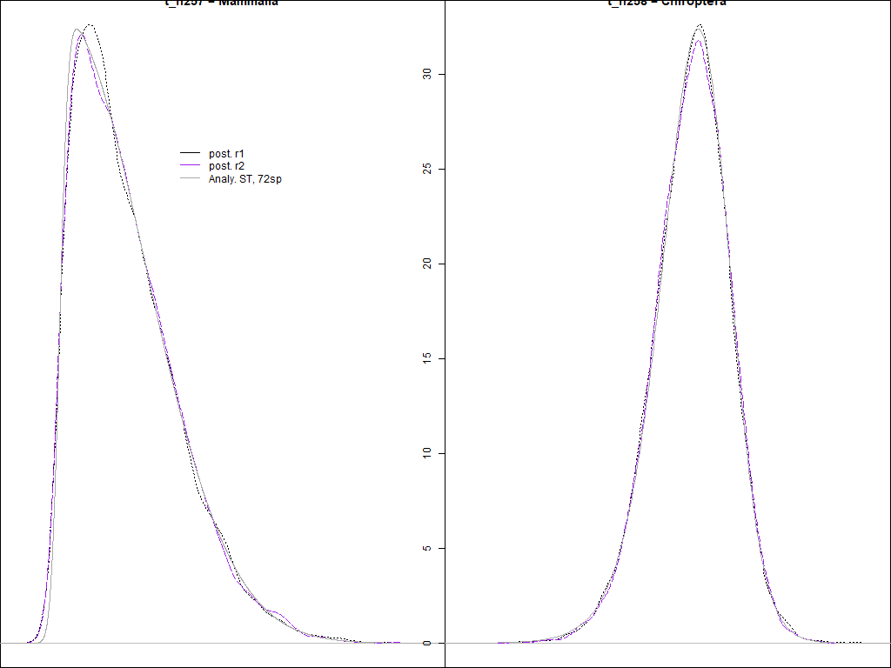
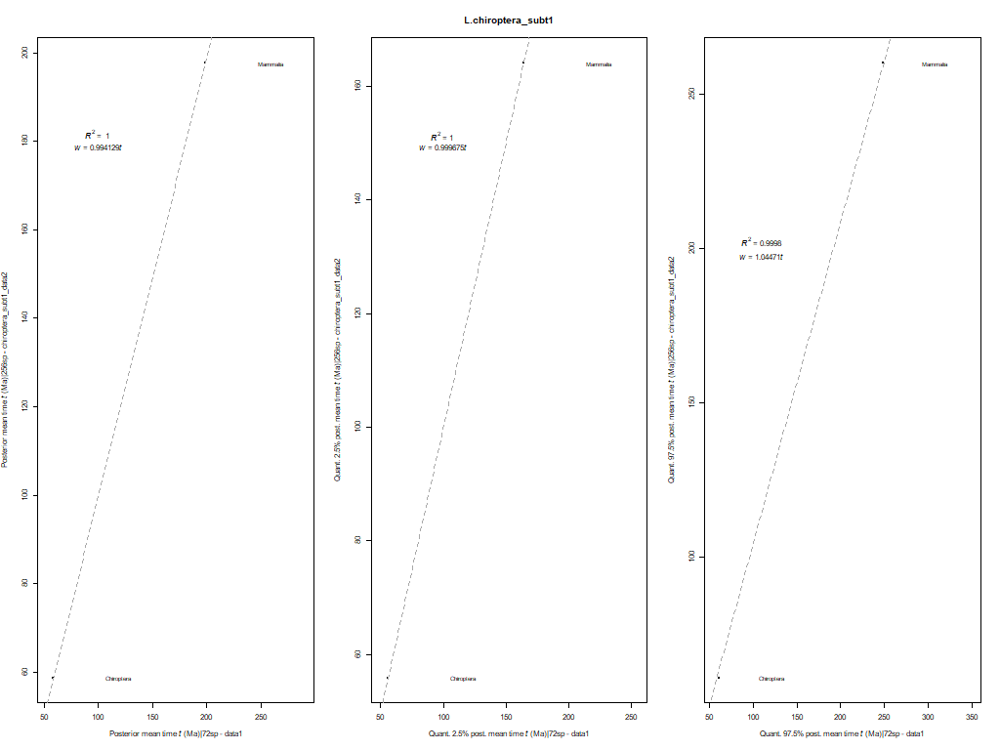
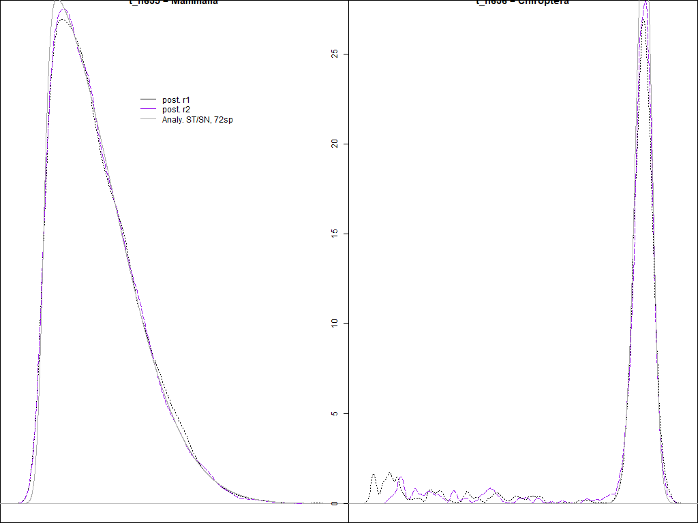
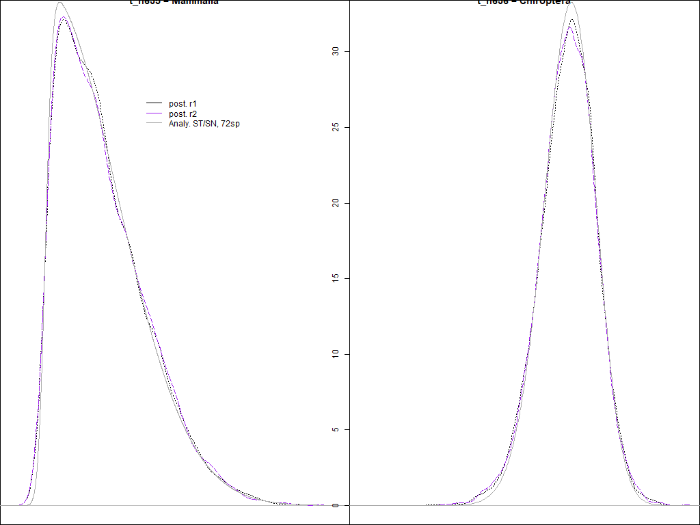
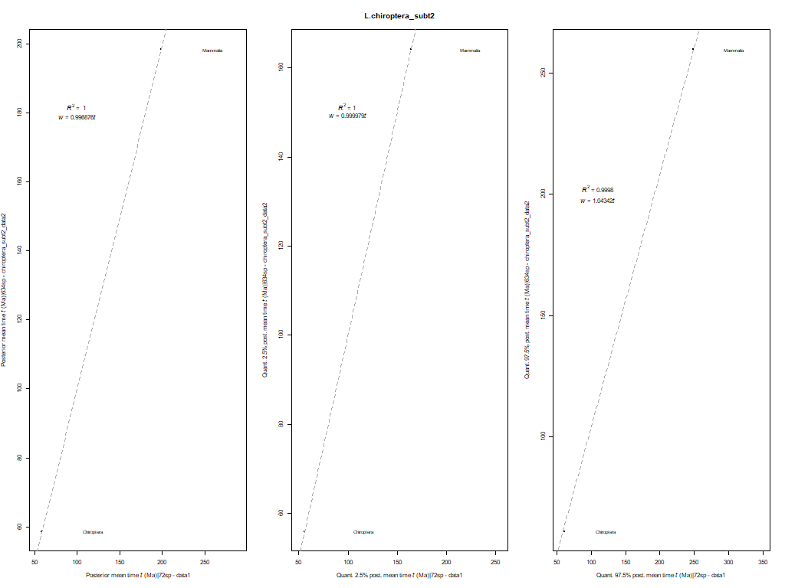

# Chiroptera - phylogeny

## 1. Get tree topology and add calibrations
We use the R scripts [`Calibrations_Lchiroptera_I.R`](00_Filter_trees/Chiroptera_I/Calibrations_Lchiroptera_I.R)
and [`Calibrations_Lchiroptera_II.R`](00_Filter_trees/Chiroptera_II/Calibrations_Lchiroptera_II.R)
to generate the phylogeny for this data subset. The tag names and the corresponding calibrations 
for the nodes that are to be calibrated have been included in the corresponding tree topologies 
for each subtree (i.e., see
[here](00_Filter_trees/Chiroptera_I/laurasiatheria_chiropteraI_calibnames.tree) for subtree 1 and 
[here](00_Filter_trees/Chiroptera_II/laurasiatheria_chiropteraII_calibnames.tree) for subtree 2).
These tag names are later replaced with the
corresponding calibrations specified in the calibations text file (i.e., see
[here](00_Filter_trees/Chiroptera_I/Calibrations_LaurChiroptera.txt) for the calibrations used in the first 
subtree and [here](00_Filter_trees/Chiroptera_II/Calibrations_LaurChiroptera.txt)
for those used in the second subtree).

In addition, this R script generates dummy alignments that can be used 
when running `MCMCtree` without the data to reduce disk space (see next section 3). 
This "dummy" alignment is saved [here](../../../01_alignments/01_mammal_dummy_alns/chiroptera_subt1) for 
the first subtree and [here](../../../01_alignments/01_mammal_dummy_alns/chiroptera_subt2) for the second.

After running this script, you will have the following files:

```
00_Filter_trees
    |- RAxML_tree
    |    |- Laurasiatheria_chiroptera.tree                     # File not used. Best-scoring ML tree obtained with RAxML
    |- Chiroptera_X                                            # Chiroptera_I or Chiroptera_II, one directory for each subtree with the same content
      |         
      |- XXXsp_Laurasiatheria_chiroptera_MCMCtree_calib.tree   # File output by the R script
      |- XXXsp_Laurasiatheria_chiroptera_spnameslist.txt       # File output by the R script
      |- Calibrations_LaurChiroptera.txt                       # Input file used by the R script. It matches the tag names
      |                                                        # in input tree with corresponding calibrations to be replaced
      |- Calibrations_LChiroptera_X.R                          # R script
      |- laurasiatheria_chiropteraX_calibnames.tree            # Input file used by the R script
      |- laurasiatheria_chiropterax_rooted_baseml.tree         # File manually generated after running R script 
                                                               # to be used by BASEML (calibrations manually removed)
```


## 2. Generating subtree -- splitting the main tree into two
Remember that we partitioned the big data subset (885 bat species in "chiroptera" data subset) into two 
data subsets (see the details in
[this `README.md` file](../filter_aln/README.md),
section `# EXTRA FILTERING -- DATA SUBSETTING`, if you did not go through the data filtering before,
which explains why we further partition "chiroptera"). This is the reason for 
having two separate tree topologies for Chiroptera.

## 3. Check if calibrations are in conflict
The trees described above were used to find 
if there were any conflicts with the calibations used in both subtrees.
You can download the directories 
with the results obtained when running `MCMCtree` without the data
[here](https://www.dropbox.com/s/fnzbelxhzknwqr2/SeqBayesS2_check_conflict_chirosubt1.zip?dl=0)
for the first subtree and 
[here](https://www.dropbox.com/s/soqn03bm8gcoar3/SeqBayesS2_check_conflict_chirosubt2.zip?dl=0)
for the second subtree.
Once you download them, you should unzip their content inside the corresponding
[`01_Check_conflict`](01_Check_conflict)
directory for each subtree:

```
01_Check_conflict 
      |- 01_Chiroptera_subtree1  # Save the unzipped content of chiroptera subtree 1
      |- 01_Chiroptera_subtree2  # Save the unzipped content of chiroptera subtree 2
```

Please read all the comments and explanations in
the R scripts provided in the corresponding subdirectories above
to understand each step that we followed to avoid having conflicting calibrations in
the tree topology. Sometimes, we might need to adjust the ST calibrations and/or maximum
bounds if the neighbouring calibrations are in conflict (e.g., there are truncation issues). 

In a nutshell:   

   1. First, we run `MCMCtree` without using the data (i.e., 
   without using the alignment, hence the "dummy" alignment used here) and fixing the
   tree topology where only the skew-_t_ (ST) calibrations have been added.   
   2. For each calibrated node, we plot the corresponding analytical ST distribution
   (the one that we have told `MCMCtree` to use) against the corresponding posterior density
   inferred by `MCMCtree` when no data are used (data described in step 1). In addition,
   we add to this plot the posterior density of this node that was inferred by `MCMCtree`
   when using the first data set (72-taxon data set).   
   3. To check for conflict, we do the following for each calibrated node with an 
   ST calibration:   
      * Estimate mean times and quantiles (2.5% and 97.5%) from the posterior density
	  inferred by `MCMCtree` when the data are not used and the fixed tree topology has only
	  ST distributions.   
	  * Estimate mean times and quantiles from the posterior density inferred with
	  data set 1 (72-taxon data set) for the same node.   
	  * Check how much the former deviate from the latter.   
	  * If deviation is lower than ~5%, proceed with step 4.   
   4. If checks in step 3 are ok, we run `MCMCtree` without the data alignment but
   the tree topology now has both the ST calibrations and the calibrations with soft
   bounds (i.e., calibrations that have a minimum and a maximum bound with a 2.5% tail
   probability in each side).   
   5. Then, we generate the same plot as described in step 2.    
   6. Last, we check again for possible conflict as described in step 3. If deviation
   is lower than ~5% for all calibrated nodes, this is the end of the checks. Otherwise, we need 
   to adjust the location and scale parameters of the ST calibrations until no conflict
   is observed by subtracting the corresponding deviation (more details in the R script
   if this adjustment is taking place).   

## Chiroptera subtree 1
**When using only ST calibrations**   
Calibrations used:   
   * Mammalia: ST(1.642,0.425,12.652,1714.565)   
   * Chiroptera: ST(0.596,0.016,-1.239,13.572)   
   
<p align="center">
  
</p>

**When using both ST and soft bound calibrations**   
Calibrations used:   
   * Mammalia: ST(1.642,0.425,12.652,1714.565)   
   * Chiroptera: ST(0.596,0.016,-1.239,13.572)   
   * Monotremata: B(0.2446,1.3320)   
   * Tachyglossidae: B(0.0258,1.3320)   
   * Hipposideridae-Rhinolophidae: B(0.38,0.56)   
   * Craseonycteridae-Megadermatidae: B(0.339,0.478)   

<p align="center">
  
</p>

**Deviations (main 72-taxa VS chiroptera_subt1 data sets)**   
<p align="center">
  
</p>

The final tree topology can be found in the
[`final_tree_topology`](/02_Final_tree_topology)
directory.

## Chiroptera subtree 2

**When using only ST calibrations**   
Calibrations used:   
   * Mammalia: ST(1.642,0.425,12.652,1714.565)   
   * Chiroptera: ST(0.596,0.016,-1.239,13.572)   
   
<p align="center">
  
</p>

**When using both ST and soft bound calibrations**   
Calibrations used:   
   * Mammalia: ST(1.642,0.425,12.652,1714.565)   
   * Chiroptera: ST(0.596,0.016,-1.239,13.572)   
   * Monotremata: B(0.2446,1.3320)   
   * Tachyglossidae: B(0.0258,1.3320)   
   * Molossidae-V-M: B(0.38,0.56)   
   * Molossidae-V-M-N: B(0.38,0.56)   

<p align="center">
  
</p>

**Deviations (main 72-taxa VS chiroptera_subt2 data sets)**   
<p align="center">
  
</p>

The final tree topology can be found in the
[`final_tree_topology`](02_Final_tree_topology)
directory.

--- 

The next step is to run `MCMCtree` with the final tree topology and the 5-partitions 
alignment! Before that, however, we need to run `BASEML` to calculate the Hessian and 
the gradient, which are needed for the approximate likelihood calculation used by 
`MCMCtree` to speed up the Bayesian inference of divergence times.