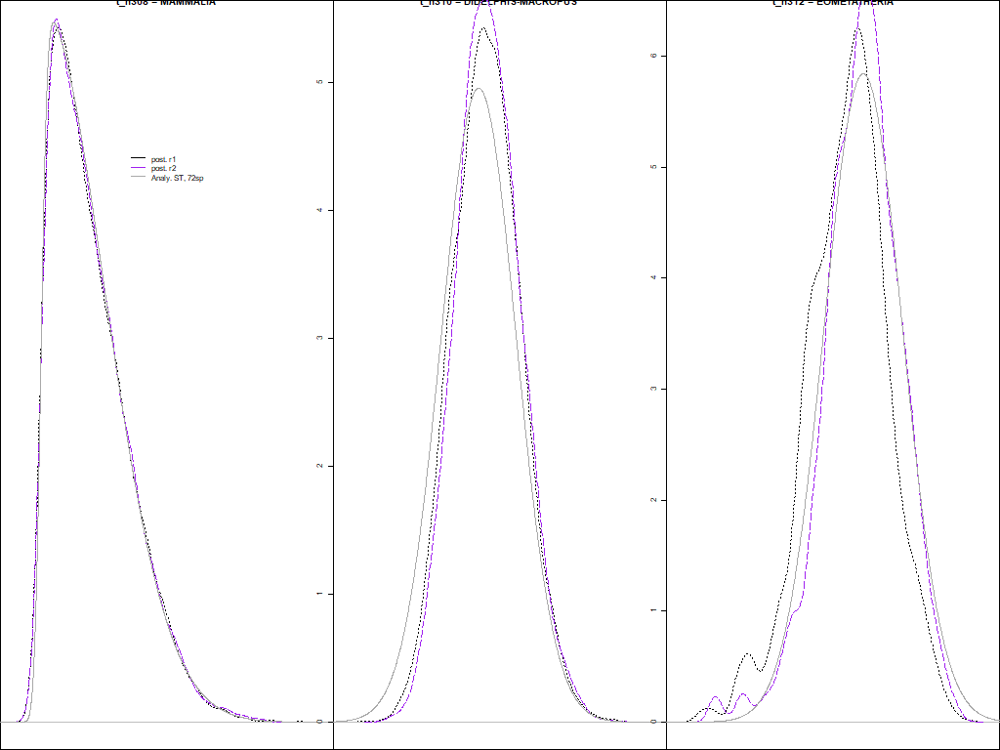
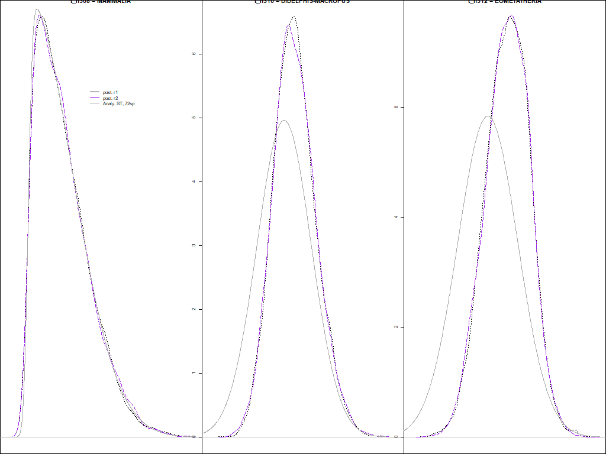
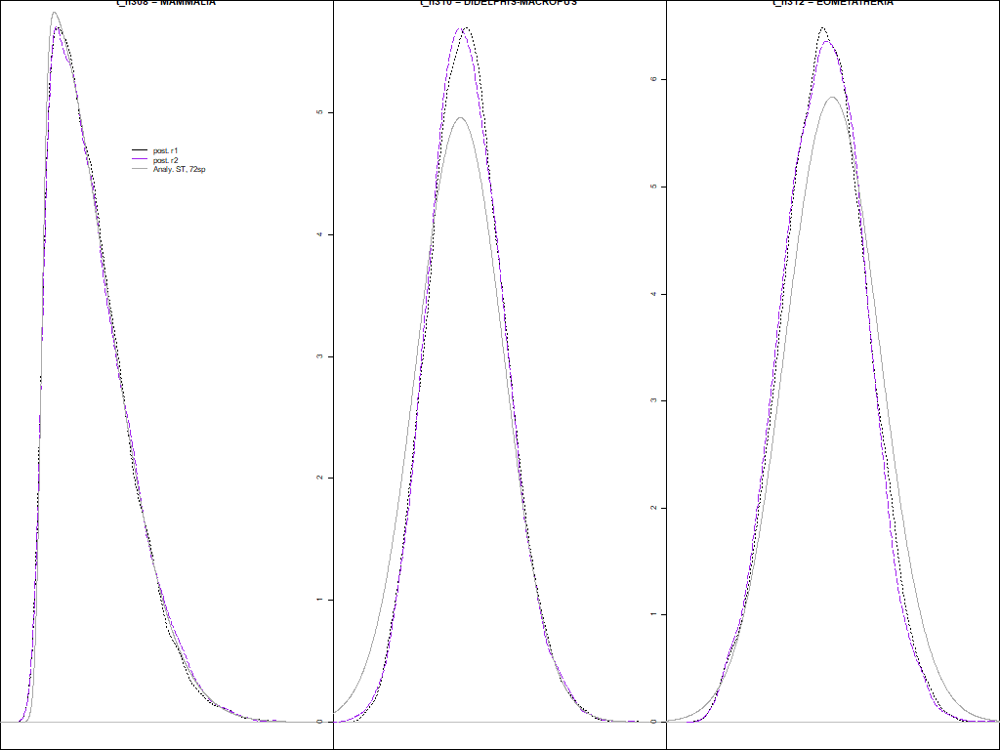
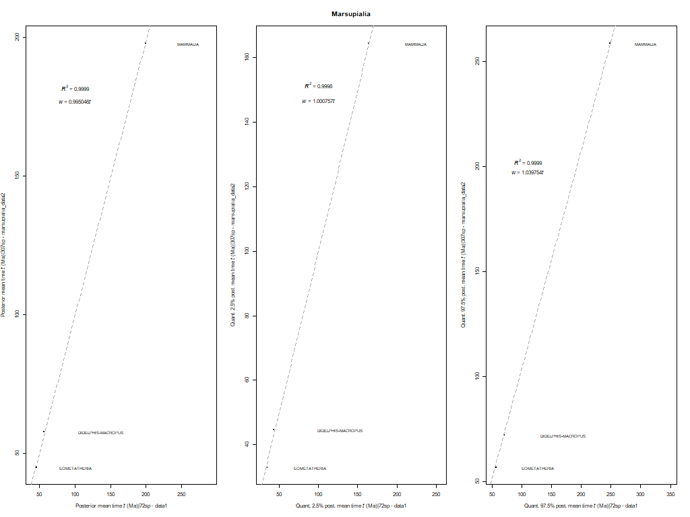

# Marsupialia - phylogeny

## 1. Get tree topology and add calibrations
We use the R script [`Calibrations_Marsupialia.R`](00_Filter_trees/Calibrations_Marsupialia.R)
to generate the phylogeny for this data subset. Note that we use the
[`marsupialia_rooted_calibnames.tree`](00_Filter_trees/marsupialia_rooted_calibnames.tree)
file, where tag names have been manually added in the 
nodes that are to be calibrated. These tag names are later replaced with the
corresponding calibrations specified in the 
[`Calibrations_Marsupialia.txt`](00_Filter_trees/Calibrations_Marsupialia.txt)
file. 
In addition, this R script generates dummy alignments that can be used 
when running `MCMCtree` without the data to reduce disk space (see next section 3). 
This "dummy" alignment is saved [here](../../../01_alignments/01_mammal_dummy_alns/marsupialia).

After running this script, you will have the following files:

```
00_Filter_trees 
     |- RAxML_tree
     |         |- marsupialia.tree             # File not used. Best-scoring ML tree obtained with RAxML
     |- extra_filtering         
     |         
     |- 307sp_Marsupialia_MCMCtree_calib.tree  # File output by the R script
     |- 307sp_Marsupialia_spnameslist.txt      # File output by the R script
     |- Calibrations_Marsupialia.R             # R script
     |- Calibrations_Marsupialia.txt           # Input file used by the R script. It matches the tag names
     |                                         # in input tree with corresponding calibrations to be replaced
     |- marsupialia_rooted_baseml.tree         # File manually generated after running R script 
     |                                         # to be used by BASEML (calibrations manually removed)
     |- marsupialia_rooted_calibnames.tree     # Input file used by the R script
```

Note that we manually generated the
[`marsupialia_rooted_baseml.tree`](00_Filter_trees/marsupialia_rooted_baseml.tree),
which does not contain the calibrations. This file is no longer used after the tree topology 
was updated (see below).

## 2. Manual change due to conflict with literature
The pyhlogeny in
[`307sp_Marsupialia_MCMCtree_calib.tree`](00_Filter_trees/307sp_Marsupialia_MCMCtree_calib.tree)
has an outdated 
tree topology that does not correspond to the latest literature.
The new tree topology has the following clustering:

```
The topology from Mitchell et al. 2014 MB&E shows a pretty robust dataset
& topology, with an Australidelphia like this:
(Dromiciops,((notoryctids,(peramelians,dasyuromorphs)),diprotodonts))
as in supp fig. s1 here:
https://eur01.safelinks.protection.outlook.com/?url=https%3A%2F%2Facademic.oup.com%2Fmbe%2Farticle%2F31%2F9%2F2322%2F2925703&amp;data=02%7C01%7C%7C03e288fc3d954af8220408d80e43f743%7C569df091b01340e386eebd9cb9e25814%7C0%7C0%7C637275032363930685&amp;sdata=41BkZWuHS8z9jeHyoxXWRKnvxg1QTl8eSkhFFvwJOpc%3D&amp;reserved=0
```

The updated file to be used by `BASEML` and the calibrated tree before the checks 
shown in the next step can be found
[here](00_Filter_trees/extra_filtering). 


## 3. Check if calibrations are in conflict
The tree with the topology described above was used to check 
if there were any conflicts with the calibations used.
You can download the directories 
with the results obtained when running `MCMCtree` without the data
[here](https://www.dropbox.com/s/ymylk5f7ecjp62k/SeqBayesS2_check_conflict_marsupialia.zip?dl=0).
Once you download them, you should unzip its content and save the 
directories inside the 
[`01_Check_conflict`](01_Check_conflict)
directory so the file architecture is the following:

```
01_Check_conflict 
      |- 00_Prior_onlyST                   # Provided in the zip file, not in this repository due to lack of space
      |- 01_Prior_SBandST                  # Provided in the zip file, not in this repository due to lack of space
      |- 02_Prior_ST_filtSB_max0.3pU0.025  # Provided in the zip file, not in this repository due to lack of space
      |- outRdata                          # Directory  with R objects generated by the R script
      |- 00_Check_STanalitycalVSprior.R    # R script 
      |- *[pdf|png]                        # Files output by the R script, provided here
      |- *tsv                              # File output by the R script, provided here
```

Please read all the comments and explanations in
[the R script provided in this directory](01_Check_conflict/00_Check_STanalitycalVSprior.R) 
to understand each step that we followed to avoid having conflicting calibrations in
the tree topology. Sometimes, we might need to adjust the ST calibrations and/or maximum
bounds if the neighbouring calibrations are in conflict (e.g., there are truncation issues). 

In a nutshell:   

   1. First, we run `MCMCtree` without using the data (i.e., 
   without using the alignment, hence the "dummy" alignment used here) and fixing the
   tree topology where only the skew-_t_ (ST) calibrations have been added.   
   2. For each calibrated node, we plot the corresponding analytical ST distribution
   (the one that we have told `MCMCtree` to use) against the corresponding posterior density
   inferred by `MCMCtree` when no data are used (data described in step 1). In addition,
   we add to this plot the posterior density of this node that was inferred by `MCMCtree`
   when using the first data set (72-taxon data set).   
   3. To check for conflict, we do the following for each calibrated node with an 
   ST calibration:   
      * Estimate mean times and quantiles (2.5% and 97.5%) from the posterior density
	  inferred by `MCMCtree` when the data are not used and the fixed tree topology has only
	  ST distributions.   
	  * Estimate mean times and quantiles from the posterior density inferred with
	  data set 1 (72-taxon data set) for the same node.   
	  * Check how much the former deviate from the latter.   
	  * If deviation is <0.6%, proceed with step 4.   
   4. If checks in step 3 are ok, we run `MCMCtree` without the data alignment but
   the tree topology now has both the ST calibrations and the calibrations with soft
   bounds (i.e., calibrations that have a minimum and a maximum bound with a 2.5% tail
   probability in each side).   
   5. Then, we generate the same plot as described in step 2.    
   6. Last, we check again for possible conflict as described in step 3. If deviation
   is <0.6% for all calibrated nodes, this is the end of the checks. Otherwise, we need 
   to adjust the location and scale parameters of the ST calibrations until no conflict
   is observed by subtracting the corresponding deviation (more details in the R script
   if this adjustment is taking place).   

In this case (marsupialia), we had to undergo some rounds of adjusting calibrations as there were
conflicts encountered (see plots below but also other plots within this directory):

**When using only ST calibrations**   
Calibrations used:   
   * Mammalia: ST(1.642,0.425,12.652,1714.565)  
   * Didelphimorphia-Australidelphia: ST(0.562,0.08,0.035,299.837)   
   * Eometatheria: ST(0.459,0.068,0.025,623.433)   
   
<p align="center">
  
</p>


**When using both ST and soft bound calibrations**   
Calibrations used:   
   * Mammalia: ST(1.642,0.425,12.652,1714.565)  
   * Didelphimorphia-Australidelphia: ST(0.562,0.08,0.035,299.837)   
   * Eometatheria: ST(0.459,0.068,0.025,623.433)   
   * Monotremata: B(0.1289,1.345)   
   * Tachyglossidae: B(0.0258,1.345)   
   * Marsupialia: B(0.476,1.313)   
   * Paucituberculata: B(0,0.1597)   
   * Didelphimorphia: B(0.11608,0.281)   
   * **Dasyuromorphia: ~B(0.1597,0.5465)~ -- CONFLICT, adjusted**
   **to B(0.1597,0.3) for next round**   
   * Peramelemorphia: B(0.0436,0.238)    
   * **Vombatiformes: ~B(0.2550,0.5465)~ -- CONFLICT, adjusted**   
   **to B(0.2550,0.3) for next round**   
   * **Phalangeriformes: ~B( 0.2500,0.5465)~ -- CONFLICT, adjusted**   
   **to B(0.2500,0.3) for next round**   
   * **Petauridae: ~B(0.2550,0.5465)~ -- CONFLICT, adjusted**   
   **to B(0.2550,0.3) for next round**   
   * **Macropodoidea: ~B(0.2470,0.5465)~ -- CONFLICT, adjusted**    
   **to B(0.2470,0.3) for next round**   
   
<p align="center">
  
</p>


**When using both ST and soft bound calibrations - 2nd round**   
Calibrations used:   
   * Mammalia: ST(1.642,0.425,12.652,1714.565)  
   * Didelphimorphia-Australidelphia: ST(0.562,0.08,0.035,299.837)   
   * Eometatheria: ST(0.459,0.068,0.025,623.433)   
   * Monotremata: B(0.1289,1.345)   
   * Tachyglossidae: B(0.0258,1.345)   
   * Marsupialia: B(0.476,1.313)   
   * Paucituberculata: B(0,0.1597)   
   * Didelphimorphia: B(0.11608,0.281)   
   * Dasyuromorphia: B(0.1597,0.3)
   * Peramelemorphia: B(0.0436,0.238)    
   * Vombatiformes: B(0.2550,0.3)   
   * Phalangeriformes: B( 0.2500,0.3)   
   * Petauridae: B(0.2550,0.3)   
   * Macropodoidea: B(0.2470,0.3)    
   
<p align="center">
  
</p>


**Deviations (main 72-taxa VS Marsupialia data sets)**   
<p align="center">
  
</p>

The final tree topology can be found in the
[`final_tree_topology`](02_Final_tree_topology)
directory.

--- 

The next step is to run `MCMCtree` with the final tree topology and the 5-partitions 
alignment! Before that, however, we need to run `BASEML` to calculate the Hessian and 
the gradient, which are needed for the approximate likelihood calculation used by 
`MCMCtree` to speed up the Bayesian inference of divergence times.