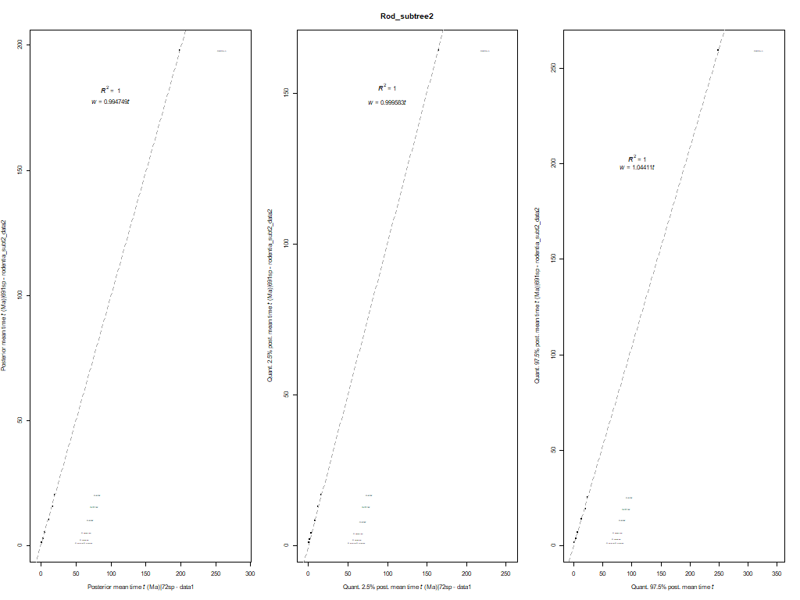

# Rodentia the rest - phylogeny

## 1. Get tree topology and add calibrations
For each subtree, we use an R script
to generate the corresponding phylogeny (see
[here](00_Filter_trees/Rodentia_therest_I/Calibrations_Rtherest.R) for the first 
subtree and 
[here](00_Filter_trees/Rodentia_therest_II/Calibrations_Rtherest.R) for the second). We have generated 
tree files with the calibrations for each subtree (see
[here](00_Filter_trees/Rodentia_therest_I/rodentia_therestI_rooted_calibnames.tree) for the first subtree and 
[here](00_Filter_trees/Rodentia_therest_II/rodentia_therestII_rooted_calibnames.tree) for the second),
where tag names have been manually added in the 
nodes that are to be calibrated. These tag names are later replaced with the
corresponding calibrations specified in the corresponding text files  
(see [here](00_Filter_trees/Rodentia_therest_I/Calibrations_rodtherest.txt) for the first subtree and 
[here](00_Filter_trees/Rodentia_therest_II/Calibrations_rodtherest.txt) for the second).

In addition, this R script generates dummy alignments that can be used 
when running `MCMCtree` without the data to reduce disk space (see next section 3). 
This "dummy" alignment is saved [here](../../../01_alignments/01_mammal_dummy_alns/rodentia_subt1) for 
the first subtree and [here](../../../01_alignments/01_mammal_dummy_alns/rodentia_subt2) for the second subtree.

After running this script, you will have the following files:

```
00_Filter_trees
    |- RAxML_tree
    |    |- rodentia_therest.tree                              # File not used. Best-scoring ML tree obtained with RAxML for the "Rodentia the rest" before it was split into two subtrees
    |- Rodentia_therest_X                                      # Rodentia_therest_I or Rodentia_therest_II, one directory for each subtree with the same content
      |         
      |- XXXsp_Rodentia_therest_MCMCtree_calib.tree            # File output by the R script
      |- XXXsp_Rodentia_therest_spnameslist.txt                # File output by the R script
      |- Calibrations_rodtherest.txt                           # Input file used by the R script. It matches the tag names
      |                                                        # in input tree with corresponding calibrations to be replaced
      |- Calibrations_Rtherest.R                               # R script
      |- rodentia_therestX_rooted_calibnames.tree              # Input file used by the R script
      |- laurasiatheria_chiropterax_rooted_baseml.tree         # File manually generated after running R script 
                                                               # to be used by BASEML (calibrations manually removed)
```

Note that we manually generated the
`rodentia_therestX_rooted_calibnames.tree` files,
which do not contain the calibrations. 

## 2. Generating subtree -- splitting the main tree into two
After partitioning the big data subset (1314 rodent species in "rodentia the rest") into two 
data subsets (see the details in
[this `README.md` file](../filter_aln/README.md),
section `# EXTRA FILTERING -- DATA SUBSETTING`, if you did not go through the data filtering before,
which explains why we further partition "rodentia the rest").

## 3. Check if calibrations are in conflict
The trees described above were used to find 
if there were any conflicts with the calibations used in both subtrees.
You can download the directories 
with the results obtained when running `MCMCtree` without the data
[here](https://www.dropbox.com/s/tu9mcwel50953c6/SeqBayesS2_check_conflict_rodsubt1.zip?dl=0)
for the first subtree and 
[here](https://www.dropbox.com/s/8yglaevkid1zrsq/SeqBayesS2_check_conflict_rodsubt2.zip?dl=0)
for the second subtree.
Once you download them, you should unzip its content and save the 
directories inside the corresponding
[`01_Check_conflict`](01_Check_conflict)
directory for each subtree:

```
01_Check_conflict 
      |- 01_Check_conflict_rodsubtree1  # Save the unzipped content of rodentia subtree 1
      |- 01_Check_conflict_rodsubtree2  # Save the unzipped content of rodentia subtree 2
```

Please read all the comments and explanations in
the R scripts provided in the corresponding subdirectories above
to understand each step that we followed to avoid having conflicting calibrations in
the tree topology. Sometimes, we might need to adjust the ST calibrations and/or maximum
bounds if the neighbouring calibrations are in conflict (e.g., there are truncation issues). 

In a nutshell:   

   1. First, we run `MCMCtree` without using the data (i.e., 
   without using the alignment, hence the "dummy" alignment used here) and fixing the
   tree topology where only the skew-_t_ (ST) calibrations have been added.   
   2. For each calibrated node, we plot the corresponding analytical ST distribution
   (the one that we have told `MCMCtree` to use) against the corresponding posterior density
   inferred by `MCMCtree` when no data are used (data described in step 1). In addition,
   we add to this plot the posterior density of this node that was inferred by `MCMCtree`
   when using the first data set (72-taxon data set).   
   3. To check for conflict, we do the following for each calibrated node with an 
   ST calibration:   
      * Estimate mean times and quantiles (2.5% and 97.5%) from the posterior density
	  inferred by `MCMCtree` when the data are not used and the fixed tree topology has only
	  ST distributions.   
	  * Estimate mean times and quantiles from the posterior density inferred with
	  data set 1 (72-taxon data set) for the same node.   
	  * Check how much the former deviate from the latter.   
	  * If deviation is less than 5%, proceed with step 4.   
   4. If checks in step 3 are ok, we run `MCMCtree` without the data alignment but
   the tree topology now has both the ST calibrations and the calibrations with soft
   bounds (i.e., calibrations that have a minimum and a maximum bound with a 2.5% tail
   probability in each side).   
   5. Then, we generate the same plot as described in step 2.    
   6. Last, we check again for possible conflict as described in step 3. If deviation
   is less than 5% for all calibrated nodes, this is the end of the checks. Otherwise, we need 
   to adjust the location and scale parameters of the ST calibrations until no conflict
   is observed by subtracting the corresponding deviation (more details in the R script
   if this adjustment is taking place).   

## Rodentia subtree 1
**When using only ST calibrations**   
Calibrations used:   
   * Mammalia: ST(1.642,0.425,12.652,1714.565)   
   * _D. ordii_ - Myomorpha: ST(0.55,0.006,-0.171,6.759)   
   * Dipodidae-Muroidea: ST(0.473,0.017,-1.282,13.044)   
   * _N. galilii_ - Muridae: ST(0.382,0.022,-0.67,36.812)   
   * Muridae: ST(0.174,0.035,3.117,381.97)     
   * _M. auratus_ - _C. griseus_: ST(0.088,0.022,3.756,209.065)   
   * _P. maniculatus_ - _M. ochrogaste_: ST(0.128,0.029,3.532,404.416)   
   * Murinae: ST(0.089,0.024,3.794,547.445)   
   
<p align="center">
  
</p>

**When using both ST and soft bound calibrations**   
Calibrations used:   
   * Mammalia: ST(1.642,0.425,12.652,1714.565)   
   * _D. ordii_ - Myomorpha: ST(0.55,0.006,-0.171,6.759)   
   * Dipodidae-Muroidea: ST(0.473,0.017,-1.282,13.044)   
   * _N. galilii_ - Muridae: ST(0.382,0.022,-0.67,36.812)   
   * Muridae: ST(0.174,0.035,3.117,381.97)     
   * _M. auratus_ - _C. griseus_: ST(0.088,0.022,3.756,209.065)   
   * _P. maniculatus_ - _M. ochrogaste_: ST(0.128,0.029,3.532,404.416)   
   * **Murinae: ~ST(0.089,0.024,3.794,547.445)~ -- CONFLICT, adjusted**   
   **to ST(0.094,0.027,3.794,547.445) for next round**      
  
   
<p align="center">
  
</p>

**When using both ST and soft bound calibrations - 2nd round**   
Calibrations used:   
   * Mammalia: ST(1.642,0.425,12.652,1714.565)   
   * _D. ordii_ - Myomorpha: ST(0.55,0.006,-0.171,6.759)   
   * Dipodidae-Muroidea: ST(0.473,0.017,-1.282,13.044)   
   * _N. galilii_ - Muridae: ST(0.382,0.022,-0.67,36.812)   
   * Muridae: ST(0.174,0.035,3.117,381.97)     
   * _M. auratus_ - _C. griseus_: ST(0.088,0.022,3.756,209.065)   
   * _P. maniculatus_ - _M. ochrogaste_: ST(0.128,0.029,3.532,404.416)   
   * Murinae: ST(0.094,0.027,3.794,547.445)      
   
<p align="center">
  
</p>


**Deviations (main 72-taxa VS rodentia_therest data sets)**   
<p align="center">
  
</p>

The final tree topology can be found in the
[`final_tree_topology`](02_Final_tree_topology)
directory.

## Rodentia subtree 2

**When using only ST calibrations**   
Calibrations used:   
   * Mammalia: ST(1.642,0.425,12.652,1714.565)   
   * Muridae: ST(0.174,0.035,3.117,381.97)   
   * Cricetidae: ST(0.137,0.03,3.464,240.317)   
   * Murinae: ST(0.0889,0.0241,3.7938,547.4454)     
   * *Mus pahari*-rest of Mus: ST(0.043,0.013,3.575,94.222)   
   * *Mus caroli*-rest of Mus: ST(0.022,0.007,3.426,86.245)   
   * _Mus spretus_-_Mus musculus_: ST(0.0104,0.0033,3.3802,83.5293)   
   
<p align="center">
  
</p>

**When using both ST and soft bound calibrations**   
Calibrations used:   
   * Mammalia: ST(1.642,0.425,12.652,1714.565)   
   * Muridae: ST(0.174,0.035,3.117,381.97)   
   * Cricetidae: ST(0.137,0.03,3.464,240.317)   
   * **Murinae: ~ST(0.0889,0.0241,3.7938,547.4454)~ -- CONFLICT, adjusted**   
   **to ST(0.086,0.021,3.794,547.445) for next round**   
   * *Mus pahari*-rest of Mus: ST(0.043,0.013,3.575,94.222)   
   * *Mus caroli*-rest of Mus: ST(0.022,0.007,3.426,86.245)   
   * _Mus spretus_-_Mus musculus_: ST(0.0104,0.0033,3.3802,83.5293)   
   
<p align="center">
  
</p>

**When using both ST and soft bound calibrations - 2nd round**   
Calibrations used:   
   * Mammalia: ST(1.642,0.425,12.652,1714.565)   
   * Muridae: ST(0.174,0.035,3.117,381.97)   
   * Cricetidae: ST(0.137,0.03,3.464,240.317)   
   * Murinae:  ST(0.086,0.021,3.794,547.445)   
   * *Mus pahari*-rest of Mus: ST(0.043,0.013,3.575,94.222)   
   * *Mus caroli*-rest of Mus: ST(0.022,0.007,3.426,86.245)   
   * _Mus spretus_-_Mus musculus_: ST(0.0104,0.0033,3.3802,83.5293)    
   
<p align="center">
  
</p>


**Deviations (main 72-taxa VS rodentia_therest data sets)**   
<p align="center">
  
</p>

The final tree topology can be found in the
[`final_tree_topology`](02_Final_tree_topology)
directory.

--- 

The next step is to run `MCMCtree` with the final tree topology and the 5-partitions 
alignment! Before that, however, we need to run `BASEML` to calculate the Hessian and 
the gradient, which are needed for the approximate likelihood calculation used by 
`MCMCtree` to speed up the Bayesian inference of divergence times.